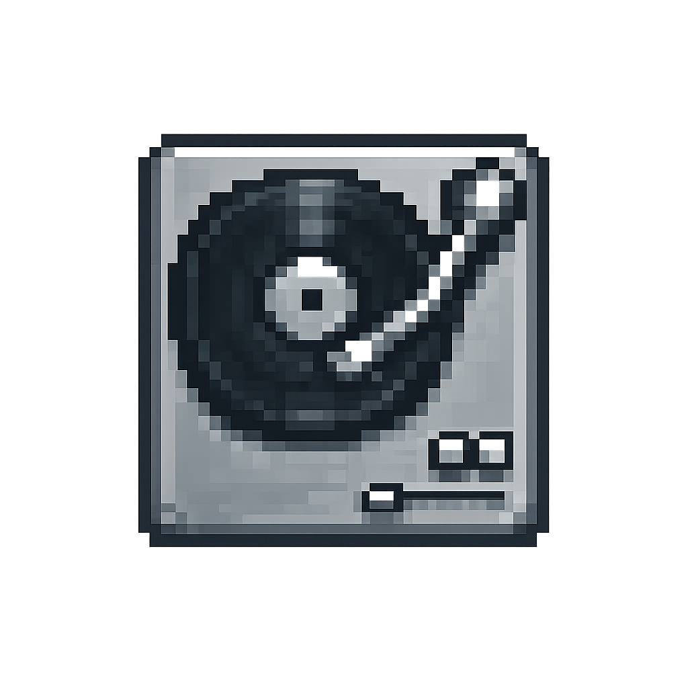

# fplayer-ff-service

<p align="center">
  
</p>

`fplayer-ff-service` 是独立部署的软件，内置 `ZLMediaKit` 作为媒体分发内核，并通过 `gateway` 向 desktop 提供会话编排接口。

> 文档入口：
> - 使用手册：`doc/使用手册.md`
> - 用户手册：`doc/man/用户手册.md`
> - 打包发布与使用教程：`doc/打包发布与使用教程.md`
> - 公网部署教程：`doc/服务端部署与使用说明.md`（含 FRP 场景与 `SERVICE_PUBLIC_HOST` 配置）
> - 技术文档：`doc/技术文档-实现说明.md`
> - Git 提交注意事项：`doc/Git提交注意事项.md`

## 技术栈

本项目为「媒体内核 + 网关 + 桌面控制台」组合部署形态，各层技术如下。

- **媒体分发内核**：[ZLMediaKit](https://github.com/ZLMediaKit/ZLMediaKit)（随仓库 `3rd` 提供预编译 `MediaServer`），负责 RTSP/RTMP/HLS/HTTP-FLV 等协议下的推流、转封装与分发。
- **会话与地址编排（Gateway）**：**Go 1.22+**（`gateway/`），对外提供 HTTP API（如健康检查、流地址解析 `resolve`），与 ZLM 协同完成运行期端口与播放地址编排。
- **内核控制台启动器**：**Go**（`kernel-console/`），用于在独立控制台中拉起/管理 ZLM 与相关子进程（与一键脚本配合）。
- **服务管理 UI**：**Electron**（`ui/`，Chromium + Node 运行时），纯前端形式的管理/控制台；使用 **electron-builder** 打包为 Windows 便携版、Linux **AppImage** 等。
- **工程与交付**：**PowerShell / Bash** 构建与启停脚本、**Git LFS** 管理大文件；UI 侧依赖 **Node.js** 与 **npm** 安装与构建。

## 功能

### 本项目可独立提供的能力

- **统一流媒体中枢**：内置 ZLM，承接推流、转封装与分发，输出 HLS / HTTP-FLV / RTMP / RTSP 等播放与接入能力。
- **流地址解析与编排**：Gateway 对外提供 `resolve` 等接口，屏蔽端口动态变化与协议细节，客户端按 `app/stream` 即可获取可播放地址。
- **服务健康与运行信息**：提供 `healthz` 健康检查与 `run/runtime.json` 运行时信息，便于联调、监控与部署排障。
- **一键启停与跨平台发布**：支持 Windows / Linux 一键启动、停止、清理与打包，快速生成可分发的 `portable-ui`、`portable-kernel`。

### 与其他项目的联合功能

- **与 `fplayer-ff-desktop` 联动（扩展协同）**：desktop 可先以 P2P/直连模式独立运行；接入 service 后，service 负责会话编排、流路由与对外地址发布，扩展可管理性与多端分发能力。
- **与 `fplayer-ff-mobile` 联动（播放消费）**：mobile 通过 Gateway 查询 `app/stream` 对应地址后直接播放，实现手机端低门槛接入，不依赖手工拼接 URL。
- **三端协同链路**：desktop 创建并推流 -> service 生成并维护可访问地址 -> mobile/desktop 拉流播放；适用于同一局域网下的采集、分发、预览与播放闭环。

## 编译环境要求

建议在 Windows 10/11 x64 或 Linux x64 环境下进行开发与打包，并确保以下工具可用：

- PowerShell 5.1+（用于执行 `scripts/*.ps1`）
- Bash 4+（用于执行 `scripts/*.sh`）
- Go 1.22+（用于编译 `gateway`）
- Node.js 20 LTS（建议）+ npm 10+（用于 UI 依赖安装与 Electron 打包）
- Git 2.40+（建议）与 Git LFS（用于大文件管理）

可选但推荐：

- Visual Studio 2022 Build Tools（部分本地原生依赖编译场景需要）

快速自检命令：

```powershell
powershell -v
go version
node -v
npm -v
git --version
git lfs version
```

## 快速启动（Windows）

开发调试：

```powershell
.\scripts\start-all.ps1
```

控制台内核启动器（独立控制台，支持 `Ctrl+C` 停止）：

```powershell
cd .\kernel-console
go run .
```

或直接双击：

- `start-service.bat`

停止：

```powershell
.\scripts\stop-all.ps1
```

或直接双击：

- `stop-service.bat`

## 快速启动（Linux）

环境检查（推荐先执行）：

```bash
./scripts/check-env-linux.sh
```

开发调试：

```bash
./scripts/start-all.sh
```

停止：

```bash
./scripts/stop-all.sh
```

发布使用（推荐）：

- Windows：先执行 `.\scripts\build-release.ps1`
- Linux：先执行 `./scripts/build-release-linux.sh`
- 按模式分离分发：
  - `release/portable-ui`（仅 UI）
  - `release/portable-kernel`（仅内核）

## 快速验证

- 健康检查：`http://127.0.0.1:<gateway-port>/healthz`（`gateway-port` 见 `run/runtime.json`）
- 运行时信息：`run/runtime.json`

## 打包为 Windows EXE

在根目录执行：

```powershell
.\scripts\build-win-package.ps1
```

该脚本会：

- 编译 `gateway.exe`（输出到 `gateway/bin/gateway.exe`）
- 编译控制台内核启动器（输出到 `kernel-console/bin/FPlayerFFServiceKernel.exe`）
- 安装 UI 依赖
- 调用 `electron-builder` 产出 Windows 安装包（`ui/dist`）

## 打包为 Linux AppImage

在根目录执行：

```bash
./scripts/build-linux-package.sh
```

该脚本会：

- 编译 `gateway`（输出到 `gateway/bin/gateway`）
- 编译控制台内核启动器（输出到 `kernel-console/bin/FPlayerFFServiceKernel`）
- 执行 Linux 环境检查并确保 `MediaServer` 可执行权限
- 安装 UI 依赖
- 调用 `electron-builder` 产出 Linux AppImage（`ui/dist`）

## 生成可发布包（推荐）

在根目录执行：

```powershell
.\scripts\build-release.ps1
```

输出目录：

- `release/`
  - 最新安装包 `.exe`
  - `portable-ui/`（UI 分发目录）
  - `portable-kernel/`（内核分发目录）
  - `win-unpacked/`（electron-builder 原始产物）

说明：

- `build-release.ps1` 会校验 `portable-ui` 与 `portable-kernel` 关键依赖是否齐全，避免发包漏 `gateway/3rd/scripts/resources`
- 打包版 UI 启动时会自动拉起 service 内核（ZLM + gateway），并默认隐藏子进程控制台窗口

Linux 在根目录执行：

```bash
./scripts/build-release-linux.sh
```

输出目录：

- `release/`
  - 最新 AppImage
  - `portable-ui/`（UI 分发目录，可执行程序：`FPlayerFFService`）
  - `portable-kernel/`（内核分发目录，可执行程序：`FPlayerFFServiceKernel`）
  - `linux-unpacked/`（electron-builder 原始产物）

说明（Linux）：

- `portable-ui/FPlayerFFService` 为启动脚本，会转发到真实 UI 可执行程序并附带 Linux 兼容参数。
- `portable-kernel/FPlayerFFServiceKernel` 为独立内核控制台程序。
- Linux 下为避免非 root 绑定低位端口失败，运行时会使用高位 `rtsp` 端口（默认优先 `8554`，实际以 `run/runtime.json` 为准）。
- 若 Linux 需绑定低位端口（如 `554`），请参考 `doc/服务端部署与使用说明.md` 的“公网部署教程 -> Linux 端口权限（root / 非 root）”。

## 清理可再生产物（可选）

在根目录执行：

```powershell
.\scripts\clean.ps1
```

Linux：

```bash
./scripts/clean.sh
```

会清理：

- `ui/dist`
- `release`
- `run`
- `logs`
- `gateway/bin/gateway.exe`

说明：

- 清理后可直接再次执行 `.\scripts\build-release.ps1` 重新生成可发布包
- `clean.ps1` 不会删除 `3rd/`、源码和文档

## 目录

- `3rd/zlm/windows/`：Windows 版 ZLMediaKit（`MediaServer.exe`）
- `3rd/zlm/Linux/` 或 `3rd/zlm/linux/`：Linux 版 ZLMediaKit（`MediaServer`）
- `gateway/`：Go 网关服务（会话创建、地址编排）
- `kernel-console/`：独立控制台内核启动器（Go）
- `ui/`：Electron 控制台
- `scripts/start-all.ps1`：一键启动 ZLM + gateway + UI
- `scripts/stop-all.ps1`：一键停止
- `scripts/start-all.sh`：Linux 一键启动 ZLM + gateway + UI
- `scripts/stop-all.sh`：Linux 一键停止
- `doc/使用手册.md`：面向使用者
- `doc/技术文档-实现说明.md`：面向开发者
